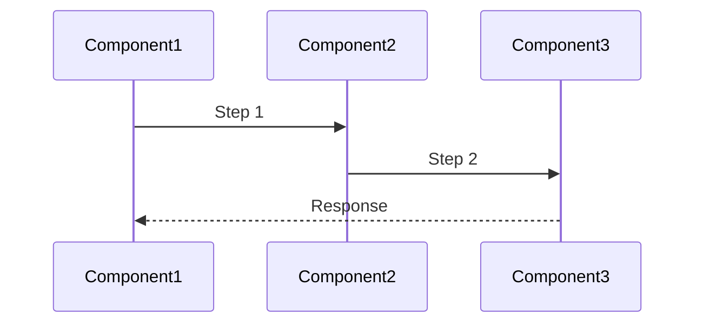
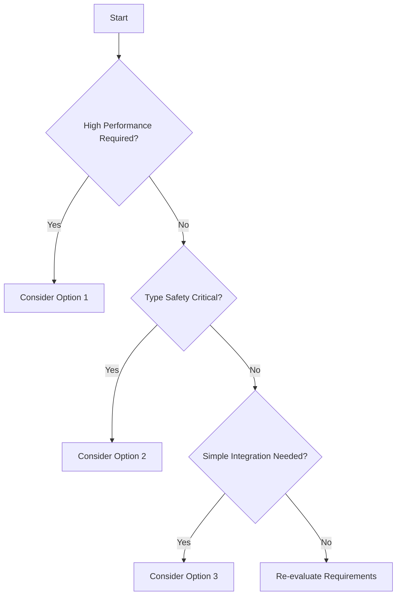

<!--
LLM Instructions for Creating Research Document from This Template:

1. FILE CREATION
   - Create new file at: `docs/architecture/researches/{YYYY-MM-DD}-{topic-slug}.md`
   - Format: YYYY-MM-DD = (date +%Y-%m-%d), topic-slug = lowercase-hyphenated-topic
   - Example: `docs/architecture/researches/2024-12-01-ipc-type-safety.md`

2. TEMPLATE USAGE
   - Copy entire template content EXCEPT this instruction block
   - Replace all placeholder values marked with {braces}
   - Complete all sections with thorough research findings
   - Remove any unused optional sections

3. RESEARCH PROCESS
   - Use multiple information sources with tools (WebSearch, Context7, DeepWiki, GitHub)
   - Compare at least 3 alternatives when possible
   - Include recent information (check publication dates)
   - Provide code examples for each pattern
   - Create comparison matrices for systematic evaluation
   - For Required Knowledge section, use appropriate categories such as:
     Core Technologies, Programming Languages, Frameworks & Libraries,
     Tools & Development Environment, Concepts & Patterns, APIs & Services

4. CONTENT GUIDELINES
   - Title: Clear description of the research topic
   - Status: Must be one of: In Progress, Completed, Archived
   - Executive Summary: 2-3 sentence overview of findings (neutral, no recommendations)
   - Problem Statement: Clear definition of the technical challenge
   - Evaluation: Use consistent criteria across all options
   - Include both pros and cons for each option
   - Present findings objectively without bias
   - Avoid making final recommendations or "best choice" statements

5. LANGUAGE & FORMATTING
   - Write ALL content in English
   - Use "@" notation for internal repository references
   - Use standard URLs for external references
   - Include mermaid diagrams where helpful
   - Format code examples with proper syntax highlighting
   - Wrap all library names in backticks
   - Prefer bullet lists over tables for better readability
   - Follow architecture writing guidelines: @docs/guides/architecture-writing-guide.md

6. IMPORTANT
   - Remove this entire instruction comment block from the new file
   - Ensure all research is current (check dates)
   - Include version numbers for libraries/frameworks
   - Document search queries used for transparency
   - Save work frequently if research is extensive
-->

---

title: {Research topic or question}
status: {In Progress | Completed | Archived}
updated: {YYYY-MM-DD}

---

## Executive Summary

{2-3 sentence overview of the research findings and key insights}

**Target Audience**: Technical decision makers evaluating options

## Prerequisites

### Required Knowledge

To fully understand the research findings and options presented in this document:

- **{Category Name}**
  - {Item Name}: {Brief description} - Reference: [{Document Title}]({URL})
    ...
    ...

## Problem Statement

### Context

{Describe the technical challenge or requirement that prompted this research}

### Requirements

- {Specific requirement or constraint}
- {Performance/scalability needs}
- {Compatibility requirements}
- {Security considerations}

### Success Criteria

- {Measurable outcome}
- {Evaluation metric}

## Research Methodology

### Information Sources

- **Web Search**: {List search queries used}
- **Documentation Review**: {Official docs, GitHub repos examined with tools like context7}
- **Community Insights**: {Forums, discussions, issues reviewed}
- **Code Analysis**: {Repositories analyzed with tools like DeepWiki}

### Evaluation Criteria

1. **Technical Fit**: {How well it solves the problem}
2. **Performance**: {Speed, efficiency, resource usage}
3. **Developer Experience**: {Ease of use, learning curve}
4. **Maintenance**: {Long-term viability, community support}
5. **Security**: {Security considerations and track record}

## Options Analysis

### Option 1: {Library/Pattern/Solution Name}

**Overview**
{Brief description of the solution}

**Key Features**

- {Feature 1}
- {Feature 2}
- {Feature 3}

**Implementation Example**

```typescript
// Example code showing typical usage
{code example}
```

**Pros**

- {Advantage 1}
- {Advantage 2}
- {Advantage 3}

**Cons**

- {Disadvantage 1}
- {Disadvantage 2}

**Metrics**

- **Community**: Stars: {number}, Contributors: {number}, Last Commit: {date}
- **Package**: Downloads: {number}, Version: {version}
- **Documentation**: {Complete/Partial/Minimal}

### Option 2: {Library/Pattern/Solution Name}

{Repeat same structure as Option 1}

### Option 3: {Library/Pattern/Solution Name}

{Repeat same structure as Option 1}

## Comparison Matrix

| Criteria          | Option 1                  | Option 2                  | Option 3                  |
| ----------------- | ------------------------- | ------------------------- | ------------------------- |
| Technical Fit     | {score/rating}            | {score/rating}            | {score/rating}            |
| Performance       | {metric}                  | {metric}                  | {metric}                  |
| Learning Curve    | {Low/Medium/High}         | {Low/Medium/High}         | {Low/Medium/High}         |
| Community Support | {Active/Moderate/Limited} | {Active/Moderate/Limited} | {Active/Moderate/Limited} |
| Documentation     | {Excellent/Good/Poor}     | {Excellent/Good/Poor}     | {Excellent/Good/Poor}     |
| Type Safety       | {Full/Partial/None}       | {Full/Partial/None}       | {Full/Partial/None}       |
| Bundle Size       | {size}                    | {size}                    | {size}                    |
| Maintenance Risk  | {Low/Medium/High}         | {Low/Medium/High}         | {Low/Medium/High}         |

## Implementation Patterns

### Pattern A: {Pattern Name}

#### Data Flow



#### Implementation

```typescript
// Detailed implementation example
{code showing the pattern}
```

**When to use**:

- {Scenario}
  ...

**Best Practices**:

- {Best practice}
  ...

### Pattern B: {Pattern Name}

#### Data Flow

{Similar structure as Pattern A}

#### Implementation

```typescript
// Detailed implementation example
{code showing the pattern}
```

**When to use**:

- {Scenario}
  ...

**Best Practices**:

- {Best practice}
  ...

## Decision Flow



## Analysis Summary

### Evaluation Results

{Summarize the key findings from the comparison matrix and options analysis without making recommendations}

### Key Considerations for Decision Making

- **Performance Requirements**: {How each option addresses performance needs}
- **Development Experience**: {Impact on developer productivity and learning curve}
- **Maintenance Burden**: {Long-term maintenance implications of each option}
- **Community Support**: {Availability of resources and community health}
- **Security Implications**: {Security considerations for each option}

### Trade-offs Analysis

- **Option 1 Trade-offs**
  - Gains: {What you get}
  - Costs: {What you sacrifice}
- **Option 2 Trade-offs**
  - Gains: {What you get}
  - Costs: {What you sacrifice}
- **Option 3 Trade-offs**
  - Gains: {What you get}
  - Costs: {What you sacrifice}

### Risk Assessment

| Option   | Risk Level        | Primary Risks | Mitigation Strategies |
| -------- | ----------------- | ------------- | --------------------- |
| Option 1 | {Low/Medium/High} | {Main risks}  | {How to mitigate}     |
| Option 2 | {Low/Medium/High} | {Main risks}  | {How to mitigate}     |
| Option 3 | {Low/Medium/High} | {Main risks}  | {How to mitigate}     |

### Scenario-Based Analysis

- **If performance is critical**: {Which options are suitable and why}
- **If rapid development is priority**: {Which options are suitable and why}
- **If long-term maintenance is key**: {Which options are suitable and why}
- **If type safety is essential**: {Which options are suitable and why}
- **If bundle size must be minimal**: {Which options are suitable and why}

## References

- {List relevant documentation and resources}
  ...

## Appendix

### Search Queries Used

```
{Search Query Used}
...
```
