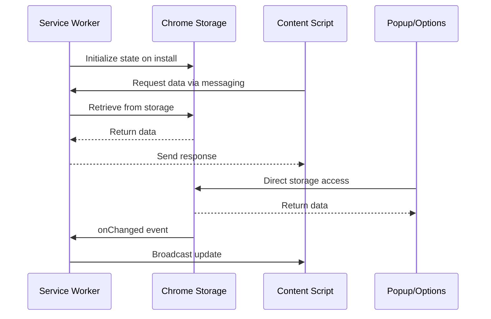
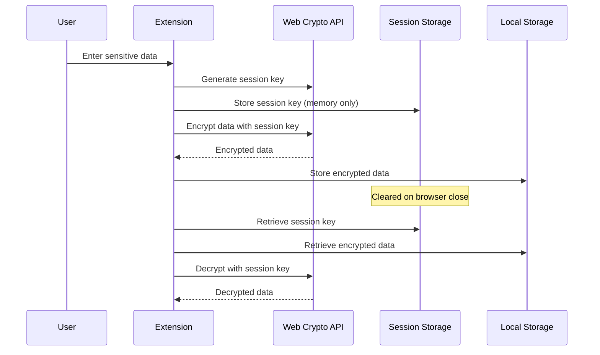
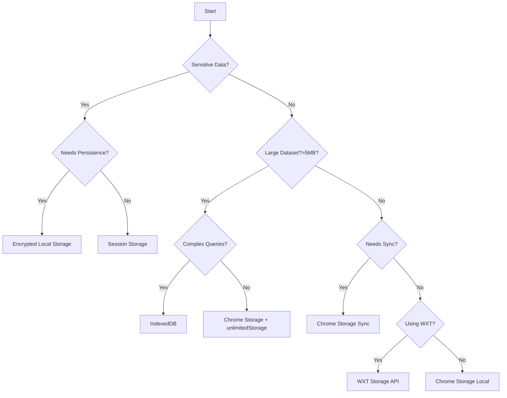

## Executive Summary

After comprehensive research of browser extension storage options in 2024-2025, the recommended approach is to use WXT Storage API as a wrapper around Chrome Storage APIs for most use cases, with IndexedDB reserved for large datasets requiring complex queries. **Critical finding (2025)**: Chrome's extension storage APIs (`chrome.storage.local`/`sync`/`managed`) provide no application-level encryption. Chrome docs warn that local and sync storage areas **should not store confidential user data** because they are not encrypted by the API; treat `sync` as part of Chrome Sync (which may be encrypted at rest on Google servers) but **do not** rely on it for secrets—encrypt sensitive values yourself and prefer `storage.session` for ephemeral secrets. See Chrome Storage API and legacy warning (still applicable): https://developer.chrome.com/docs/extensions/reference/api/storage , https://developer.chrome.com/docs/extensions/mv2/reference/storage#warnings .

**Target Audience**: Browser extension developers, AI agents implementing storage solutions, teams migrating to Manifest V3

**Security Alert**: All extension storage is readable in plain text on the user's device unless explicitly encrypted. Never store passwords, tokens, or API keys without encryption.

## Prerequisites

### Required Knowledge

To fully understand and implement the recommendations in this document:

- **Core Technologies**:
  - Browser Extension APIs: Understanding of Manifest V3 architecture and service workers
  - JavaScript/TypeScript: Proficient in async/await patterns and type systems
- **Programming Languages**:
  - TypeScript: Intermediate to advanced proficiency
  - JavaScript: Strong foundation in ES6+ features

- **Frameworks & Tools**:
  - WXT Framework: Basic understanding of modern extension development framework
  - Chrome Storage API: Familiarity with browser storage concepts
  - Web Crypto API: Basic understanding for encryption needs

## Problem Statement

### Context

Browser extensions need reliable data persistence solutions that work within the constraints of Manifest V3's service worker architecture. The transition from persistent background pages to event-driven service workers requires careful consideration of storage strategies that can handle:

- Service worker lifecycle (Chrome shuts down an extension service worker after ~30 seconds of inactivity). See "What's new in Chrome extensions": https://developer.chrome.com/docs/extensions/whats-new
- Cross-device synchronization requirements
- Security constraints for sensitive data
- Performance requirements for large datasets
- Migration from existing storage solutions

### Requirements

- Support for various data types (user preferences, application state, cached data, sensitive information)
- Performance for both small frequent operations and large bulk operations
- Cross-browser compatibility (Chrome, Firefox, Edge, Safari)
- Type safety for TypeScript development
- Security for sensitive data storage
- Data migration and versioning capabilities
- Synchronization across devices when needed

### Success Criteria

- Storage operations complete within 100ms for typical use cases
- Support for at least 5MB of local storage without special permissions
- Zero data loss during service worker termination
- Type-safe APIs preventing runtime errors
- Secure handling of sensitive data without disk persistence

## Research Methodology

### Information Sources

- **Web Search**: "browser extension data persistence storage options 2024 chrome manifest v3", "IndexedDB vs chrome.storage performance comparison security 2024", "WXT storage API implementation TypeScript", "browser extension secure data storage encryption", "webext-storage webext-core/storage comparison"
- **Documentation Review**: Chrome Developer Documentation, Mozilla MDN, WXT Framework Documentation
- **Community Insights**: Stack Overflow discussions, GitHub issues, Medium articles from 2024
- **Code Analysis**: Real-world implementations from Bitwarden, Passbolt extensions

### Evaluation Criteria

1. **Technical Fit**: Compatibility with Manifest V3 service workers
2. **Performance**: Read/write speed, memory usage, initialization time
3. **Developer Experience**: API simplicity, type safety, documentation quality
4. **Maintenance**: Community support, update frequency, long-term viability
5. **Security**: Encryption capabilities, sensitive data handling

## Options Analysis

### Option 1: Chrome Storage API (Native)

**Overview**
Native browser storage API designed specifically for extensions, offering multiple storage areas (local, sync, session, managed) with different persistence and synchronization characteristics.

**Key Features**

- Four storage areas: local, sync, session, managed
- Accessible from all extension contexts (service worker, content scripts)
- Asynchronous bulk operations
- Change listeners for real-time updates
- No CORS restrictions

**Implementation Example**

```typescript
// Store data
await chrome.storage.local.set({
  userId: "123",
  preferences: { theme: "dark" },
});

// Retrieve data
const result = await chrome.storage.local.get(["userId", "preferences"]);

// Listen for changes
chrome.storage.onChanged.addListener((changes, areaName) => {
  if (areaName === "local" && changes.userId) {
    console.log("User ID changed:", changes.userId.newValue);
  }
});

// Session storage (memory only, cleared on browser close)
await chrome.storage.session.set({ tempToken: "abc123" });
```

**Pros**

- Native support, no dependencies needed
- Designed specifically for extensions
- Multiple storage areas for different use cases
- Built-in change listeners
- Works seamlessly with service workers

**Cons**

- Poor developer experience with verbose API
- Limited to JSON-compatible types
- No built-in encryption
- Type safety requires manual implementation
- 5MB limit for local storage without permissions

**Metrics**

- **NPM Weekly Downloads**: N/A (native API)
- **GitHub Stars**: N/A
- **Last Updated**: Continuously maintained by browser vendors
- **TypeScript Support**: Yes (via @types/chrome)

### Option 2: WXT Storage API

**Overview**
Modern wrapper around browser storage APIs providing type-safe, localStorage-like interface with built-in versioning and improved developer experience.

**Key Features**

- Type-safe API with TypeScript generics
- Storage area prefixes (local:, sync:, session:, managed:)
- Built-in versioning support
- Bulk operations optimization
- Auto-import support in WXT projects
- Watch functionality for reactive updates

**Implementation Example**

```typescript
import { storage } from "wxt/storage";

// Define typed storage items
interface UserPreferences {
  theme: "light" | "dark";
  language: string;
}

// Store with type safety
await storage.setItem<UserPreferences>("local:preferences", {
  theme: "dark",
  language: "en",
});

// Retrieve with type inference
const prefs = await storage.getItem<UserPreferences>("local:preferences");

// Watch for changes with type safety
await storage.watch<UserPreferences>(
  "local:preferences",
  (newPrefs, oldPrefs) => {
    console.log("Preferences updated:", newPrefs);
  },
);

// Versioned storage for migration
await storage.setItem("local:userData", userData, {
  version: 2,
});
```

**Pros**

- Excellent TypeScript support with full type inference
- Simple, intuitive API similar to localStorage
- Built-in versioning for data migration
- Automatic handling of storage areas via prefixes
- Part of comprehensive WXT framework ecosystem
- Auto-imports in WXT projects

**Cons**

- Requires WXT framework or separate installation
- Learning curve for WXT-specific patterns
- Still limited by underlying browser storage constraints
- May require refactoring existing code

**Metrics (as of Aug 2025)**

- **NPM latest**: `wxt` v0.20.x（0.20.8 latest）
- **WXT storage**: Built into WXT; standalone `@wxt-dev/storage` available  
  Sources: https://www.npmjs.com/package/wxt , https://www.npmjs.com/package/@wxt-dev/storage

### Option 3: IndexedDB

**Overview**
Low-level browser API for storing significant amounts of structured data with support for indexes and complex queries.

**Key Features**

- Unlimited storage with unlimitedStorage permission
- Support for complex data types (Blob, File, ArrayBuffer)
- Transaction-based operations
- Index-based queries
- Works in service workers

**Implementation Example**

```typescript
// Open database
const db = await new Promise<IDBDatabase>((resolve, reject) => {
  const request = indexedDB.open("ExtensionDB", 1);

  request.onupgradeneeded = (event) => {
    const db = (event.target as IDBOpenDBRequest).result;
    if (!db.objectStoreNames.contains("userData")) {
      const store = db.createObjectStore("userData", { keyPath: "id" });
      store.createIndex("timestamp", "timestamp");
    }
  };

  request.onsuccess = () => resolve(request.result);
  request.onerror = () => reject(request.error);
});

// Store data
const transaction = db.transaction(["userData"], "readwrite");
const store = transaction.objectStore("userData");
await store.put({ id: "123", data: complexObject, timestamp: Date.now() });

// Query with index
const index = store.index("timestamp");
const range = IDBKeyRange.bound(startTime, endTime);
const results = await index.getAll(range);
```

**Pros**

- Handles large datasets efficiently (10x faster for big objects)
- Support for complex data types
- Powerful querying capabilities with indexes
- Unlimited storage with permission
- No JSON serialization overhead

**Cons**

- Complex, verbose API
- Steep learning curve
- Content scripts can access the _page origin's_ IndexedDB, not the extension's own DB  
  → Use messaging to read/write the extension's IndexedDB via service worker/extension pages  
  Refs: https://developer.mozilla.org/en-US/docs/Mozilla/Add-ons/WebExtensions/Content_scripts , https://groups.google.com/a/chromium.org/g/chromium-extensions/c/MltbW8OuYAg
- No built-in synchronization

**Metrics**

- **NPM Weekly Downloads**: N/A (native API)
- **GitHub Stars**: N/A
- **Last Updated**: Browser-dependent
- **TypeScript Support**: Yes (native)

### Option 4: Third-party Wrappers (@webext-core/storage, webext-storage)

**Overview**
Community-developed wrappers providing enhanced APIs around browser storage with focus on developer experience and type safety.

**Key Features**

- Type-safe, localStorage-like APIs
- Cross-browser compatibility
- Simplified syntax compared to native APIs
- Part of larger ecosystems with related tools

**Implementation Example**

```typescript
// @webext-core/storage
import { createStorage } from "@webext-core/storage";

interface StorageSchema {
  user: { id: string; name: string };
  settings: { theme: string };
}

const storage = createStorage<StorageSchema>({
  driver: "chrome.storage.local",
});

await storage.setItem("user", { id: "123", name: "John" });
const user = await storage.getItem("user");

// webext-storage
import { SyncStorage } from "webext-storage";

const storage = new SyncStorage<{ count: number }>();
await storage.set({ count: 0 });
const { count } = await storage.get();
```

**Pros**

- Better developer experience than native APIs
- Type safety built-in
- Active community support
- Lightweight alternatives to full frameworks

**Cons**

- Additional dependency to manage
- Varying API patterns between libraries
- May not support all browser storage features
- Less documentation than official APIs

**Metrics**

- **NPM Weekly Downloads**: 1000+ (@webext-core/storage)
- **GitHub Stars**: 100+ (various)
- **Last Updated**: 2023-2024
- **TypeScript Support**: Full

## Comparison Matrix

| Criteria          | Chrome Storage API | WXT Storage  | IndexedDB            | Third-party Wrappers |
| ----------------- | ------------------ | ------------ | -------------------- | -------------------- |
| Technical Fit     | Excellent          | Excellent    | Good                 | Good                 |
| Performance       | Fast (<50ms)       | Fast (<50ms) | Variable (10-1000ms) | Fast (<50ms)         |
| Learning Curve    | Medium             | Low          | High                 | Low-Medium           |
| Community Support | Official           | Active       | Official             | Moderate             |
| Documentation     | Excellent          | Good         | Excellent            | Variable             |
| Type Safety       | Manual             | Full         | Partial              | Full                 |
| Bundle Size       | 0KB (native)       | ~5KB         | 0KB (native)         | 2-10KB               |
| Maintenance Risk  | Low                | Low          | Low                  | Medium               |

## Implementation Patterns

### Pattern A: Service Worker State Management

#### Data Flow



#### Implementation

```typescript
// Service Worker (background.ts)
import { storage } from "wxt/storage";

// Initialize on install
chrome.runtime.onInstalled.addListener(async () => {
  await storage.setItem("local:initialized", true);
  await storage.setItem("local:version", chrome.runtime.getManifest().version);
});

// Handle state requests from content scripts
chrome.runtime.onMessage.addListener((request, sender, sendResponse) => {
  if (request.type === "GET_STATE") {
    (async () => {
      const state = await storage.getItem(`local:${request.key}`);
      sendResponse({ data: state });
    })();
    return true; // Keep channel open for async response
  }
});

// Watch for storage changes
storage.watch("local:userData", (newData, oldData) => {
  // Broadcast to all tabs
  chrome.tabs.query({}, (tabs) => {
    tabs.forEach((tab) => {
      if (tab.id) {
        chrome.tabs.sendMessage(tab.id, {
          type: "STATE_UPDATE",
          data: newData,
        });
      }
    });
  });
});
```

**When to use**:

- Managing global application state
- Coordinating between extension components
- Handling user preferences and settings

**Best Practices**:

- Always retrieve state from storage, never rely on global variables
- Use storage.session for temporary data that shouldn't persist
- Error handling: Wrap storage operations in try-catch blocks
- Use bulk operations when reading/writing multiple values

### Pattern B: Secure Data Storage

#### Data Flow



#### Implementation

```typescript
// Encryption utilities
class SecureStorage {
  private async getKey(): Promise<CryptoKey | null> {
    const keyData = await storage.getItem("session:encryptionKey");
    if (!keyData) return null;

    return await crypto.subtle.importKey(
      "raw",
      Buffer.from(keyData, "base64"),
      "AES-GCM",
      false,
      ["encrypt", "decrypt"],
    );
  }

  private async generateKey(): Promise<CryptoKey> {
    const key = await crypto.subtle.generateKey(
      { name: "AES-GCM", length: 256 },
      true,
      ["encrypt", "decrypt"],
    );

    const exported = await crypto.subtle.exportKey("raw", key);
    await storage.setItem(
      "session:encryptionKey",
      Buffer.from(exported).toString("base64"),
    );

    return key;
  }

  async storeSecure(key: string, data: any): Promise<void> {
    let cryptoKey = await this.getKey();
    if (!cryptoKey) {
      cryptoKey = await this.generateKey();
    }

    const iv = crypto.getRandomValues(new Uint8Array(12));
    const encoded = new TextEncoder().encode(JSON.stringify(data));

    const encrypted = await crypto.subtle.encrypt(
      { name: "AES-GCM", iv },
      cryptoKey,
      encoded,
    );

    await storage.setItem(`local:${key}`, {
      iv: Buffer.from(iv).toString("base64"),
      data: Buffer.from(encrypted).toString("base64"),
    });
  }

  async retrieveSecure(key: string): Promise<any> {
    const cryptoKey = await this.getKey();
    if (!cryptoKey) throw new Error("No encryption key available");

    const stored = await storage.getItem(`local:${key}`);
    if (!stored) return null;

    const decrypted = await crypto.subtle.decrypt(
      {
        name: "AES-GCM",
        iv: Buffer.from(stored.iv, "base64"),
      },
      cryptoKey,
      Buffer.from(stored.data, "base64"),
    );

    return JSON.parse(new TextDecoder().decode(decrypted));
  }
}
```

**When to use**:

- Storing authentication tokens
- Caching sensitive user data
- Temporary storage of passwords or API keys

**Best Practices**:

- Never store encryption keys in persistent storage
- Use session storage for keys that should be cleared on browser close
- Implement key rotation for long-lived data
- Always handle decryption failures gracefully

## Security Considerations (Updated 2025-08-13)

### Critical Security Facts

Based on official Chrome documentation and 2024 security research:

#### Storage Encryption Status

**CRITICAL (2025)**: Chrome docs state that local and sync storage areas should **not** store confidential user data because they are not encrypted by the API. Practically:

- Data written via `chrome.storage.local` is stored on disk without API-level encryption (OS/disk encryption is a separate matter)
- `chrome.storage.sync` participates in Chrome Sync and may be encrypted at rest on Google servers, but this is not a substitute for application-level confidentiality
- **Always encrypt sensitive data (passwords, tokens, etc.) before storage**, and prefer `storage.session` for ephemeral secrets  
  Sources: https://developer.chrome.com/docs/extensions/reference/api/storage , https://developer.chrome.com/docs/extensions/mv2/reference/storage#warnings , https://cloud.google.com/docs/security/encryption/default-encryption

#### Access Control Limitations

Extensions with storage permissions can:

- Read all data stored by the extension across all websites
- Potentially access form data entered by users (with appropriate permissions)
- Access data even after user clears browsing history
- Persist data across incognito sessions (if allowed)

#### Security Threat Landscape (2025 data points)

Recent analyses continue to uncover malicious extensions abusing permissions/dynamic rules; see technical teardown (Feb 2025): https://palant.info/2025/02/03/analysis-of-an-advanced-malicious-chrome-extension/

### Storage Security Best Practices

#### 1. Data Classification and Storage Strategy

```typescript
enum DataSensitivity {
  PUBLIC = "public", // User preferences, themes
  INTERNAL = "internal", // App state, non-sensitive cache
  SENSITIVE = "sensitive", // Tokens, user data
  CRITICAL = "critical", // Passwords, encryption keys
}

class SecureDataManager {
  async storeData(key: string, data: any, sensitivity: DataSensitivity) {
    switch (sensitivity) {
      case DataSensitivity.PUBLIC:
      case DataSensitivity.INTERNAL:
        // Store directly in chrome.storage.local
        return chrome.storage.local.set({ [key]: data });

      case DataSensitivity.SENSITIVE:
        // Encrypt before storing
        const encrypted = await this.encrypt(data);
        return chrome.storage.local.set({ [key]: encrypted });

      case DataSensitivity.CRITICAL:
        // Use session storage only (memory)
        return chrome.storage.session.set({ [key]: data });
    }
  }
}
```

#### 2. Permission Minimization

Always request the minimum storage permissions required:

```json
{
  "permissions": [
    "storage" // Only if absolutely necessary
  ],
  "host_permissions": [
    // Limit to specific domains instead of "<all_urls>"
    "https://api.example.com/*"
  ]
}
```

#### 3. Storage Access Level Control

Utilize Chrome's storage access level API to restrict access:

```typescript
// Restrict session storage to trusted contexts only
await chrome.storage.session.setAccessLevel({
  accessLevel: "TRUSTED_CONTEXTS", // Only extension pages and service worker
});

// For content scripts that need access
await chrome.storage.session.setAccessLevel({
  accessLevel: "TRUSTED_AND_UNTRUSTED_CONTEXTS",
});
// MDN: https://developer.mozilla.org/en-US/docs/Mozilla/Add-ons/WebExtensions/API/storage/StorageArea/setAccessLevel
```

#### 4. Data Expiration and Cleanup

Implement automatic data expiration for sensitive information:

```typescript
interface TimedData<T> {
  value: T;
  expiry: number;
}

class ExpiringStorage {
  async setWithExpiry<T>(key: string, value: T, ttlMinutes: number) {
    const item: TimedData<T> = {
      value,
      expiry: Date.now() + ttlMinutes * 60 * 1000,
    };
    await storage.setItem(`local:${key}`, item);
  }

  async getWithExpiry<T>(key: string): Promise<T | null> {
    const item = await storage.getItem<TimedData<T>>(`local:${key}`);
    if (!item) return null;

    if (Date.now() > item.expiry) {
      await storage.removeItem(`local:${key}`);
      return null;
    }

    return item.value;
  }
}
```

#### 5. Defense Against Extension Compromise

Implement integrity checks and anomaly detection:

```typescript
class StorageIntegrityChecker {
  private async generateChecksum(data: any): Promise<string> {
    const encoder = new TextEncoder();
    const dataBuffer = encoder.encode(JSON.stringify(data));
    const hashBuffer = await crypto.subtle.digest("SHA-256", dataBuffer);
    return Array.from(new Uint8Array(hashBuffer))
      .map((b) => b.toString(16).padStart(2, "0"))
      .join("");
  }

  async storeWithIntegrity(key: string, data: any) {
    const checksum = await this.generateChecksum(data);
    await storage.setItem(`local:${key}`, {
      data,
      checksum,
      timestamp: Date.now(),
    });
  }

  async verifyAndRetrieve(key: string): Promise<any> {
    const stored = await storage.getItem(`local:${key}`);
    if (!stored) return null;

    const calculatedChecksum = await this.generateChecksum(stored.data);
    if (calculatedChecksum !== stored.checksum) {
      console.error("Data integrity check failed!");
      await storage.removeItem(`local:${key}`);
      return null;
    }

    return stored.data;
  }
}
```

### Security Incident Response

#### Detection Indicators

Monitor for these signs of storage compromise:

- Unexpected storage quota usage spikes
- Unauthorized storage key additions
- Data modification without user action
- Storage access from unexpected contexts

#### Response Actions

1. Immediately clear all sensitive data: `chrome.storage.local.clear()`
2. Rotate all encryption keys
3. Re-authenticate users
4. Log incident for forensic analysis
5. Notify users if personal data was potentially exposed

### Compliance and Privacy

#### GDPR Considerations

- Implement data portability via storage export
- Provide clear data deletion mechanisms
- Document what data is stored and why
- Never store EU user data in sync storage without explicit consent

#### Data Minimization Principles

- Store only essential data
- Implement automatic cleanup for old data
- Use session storage for temporary data
- Avoid storing derived data that can be recalculated

### Testing Security

```typescript
// Security test suite example
describe("Storage Security Tests", () => {
  test("sensitive data should always be encrypted", async () => {
    const sensitiveData = { apiKey: "secret123" };
    await secureStorage.storeSecure("test", sensitiveData);

    // Read raw storage
    const raw = await chrome.storage.local.get("test");

    // Verify it's not plaintext
    expect(raw.test).not.toEqual(sensitiveData);
    expect(raw.test.iv).toBeDefined();
    expect(raw.test.data).toBeDefined();
  });

  test("expired data should be auto-deleted", async () => {
    await expiringStorage.setWithExpiry("temp", "data", 0.01); // 0.6 seconds
    await new Promise((resolve) => setTimeout(resolve, 1000));

    const result = await expiringStorage.getWithExpiry("temp");
    expect(result).toBeNull();
  });
});
```

## Decision Flow



## Recommendations

### Primary Recommendation

**WXT Storage API with Chrome Storage Backend + Mandatory Encryption Layer**

This combination provides the best balance of developer experience, type safety, and functionality for modern browser extension development. WXT's storage wrapper addresses the poor developer experience of native Chrome Storage APIs while maintaining full compatibility and adding valuable features like versioning and type safety.

**Security Requirements**:

1. Implement encryption for all sensitive data using Web Crypto API
2. Use session storage for temporary sensitive data
3. Apply data classification (PUBLIC, INTERNAL, SENSITIVE, CRITICAL)
4. Implement automatic data expiration for time-sensitive information
5. Regular security audits of stored data

### Technologies to Use

**IMPORTANT: These are the ONLY technologies that should be used for this implementation**

#### Core Libraries (2025)

- **`wxt`** — Next-gen extension framework. Use latest v0.20.x. Install: `pnpm add -D wxt`. Docs: https://wxt.dev/ ; npm: https://www.npmjs.com/package/wxt
- **`@wxt-dev/storage`** — (Optional) Standalone version if not using full WXT. Install: `pnpm add @wxt-dev/storage`. Docs: https://wxt.dev/storage ; npm: https://www.npmjs.com/package/@wxt-dev/storage
- **`webextension-polyfill`** — Promise-based cross-browser API. Types via `@types/webextension-polyfill` (updated Mar 2025). Repo: https://github.com/mozilla/webextension-polyfill , Types: https://www.npmjs.com/package/@types/webextension-polyfill

#### Development Tools

- **Chrome Extensions Developer Tools**: Browser DevTools for debugging storage
- **Storage Area Explorer**: Chrome extension for inspecting storage contents

### Technologies NOT to Use

**CRITICAL: Do NOT use these technologies under any circumstances**

- **localStorage/sessionStorage**
  - Reason: Not available in service workers, will cause immediate failures
  - Common mistake: Developers familiar with web development often reach for these

- **Cookies**
  - Reason: Not appropriate for extension data storage; security/partitioning concerns  
    Ref: https://developer.chrome.com/docs/extensions/develop/concepts/storage-and-cookies
  - Alternative: Use chrome.storage.session for temporary data

- **WebSQL**
  - Reason: Deprecated technology, removed from modern browsers
  - Alternative: Use IndexedDB for complex data needs

- **Unencrypted storage for sensitive data**
  - Reason: Chrome storage is not encrypted by default
  - Note: Always encrypt sensitive data before storage

### Alternative Scenarios

- **If data exceeds 100MB**: Consider IndexedDB with proper indexing strategies
- **If real-time multi-profile sync is required**: Implement WebSocket-based synchronization with backend
- **If offline-first with eventual sync**: Combine local storage with background sync API

## References

### Core Documentation

- Chrome Storage API Documentation: https://developer.chrome.com/docs/extensions/reference/api/storage
- Chrome Storage and Cookies Concepts: https://developer.chrome.com/docs/extensions/develop/concepts/storage-and-cookies
- WXT Storage Guide: https://wxt.dev/guide/essentials/storage.html
- MDN IndexedDB Guide: https://developer.mozilla.org/en-US/docs/Web/API/IndexedDB_API
- Manifest V3 Migration Guide: https://developer.chrome.com/docs/extensions/develop/migrate/to-service-workers
- What's new in Chrome extensions (service worker lifetime): https://developer.chrome.com/docs/extensions/whats-new
- StorageArea.setAccessLevel (MDN): https://developer.mozilla.org/en-US/docs/Mozilla/Add-ons/WebExtensions/API/storage/StorageArea/setAccessLevel

### Security Resources

- Google Security Blog - Staying Safe with Chrome Extensions (June 2024): https://security.googleblog.com/2024/06/staying-safe-with-chrome-extensions.html
- Mozilla Support - Extension Security Concerns: https://support.mozilla.org/en-US/questions/1225776
- Chrome Web Store Security Best Practices: https://developer.chrome.com/docs/webstore/best-practices/security
- Analysis of an advanced malicious Chrome extension (Feb 2025): https://palant.info/2025/02/03/analysis-of-an-advanced-malicious-chrome-extension/

### Related Internal Documentation

- Related RFC: @docs/architecture/rfc/2025-08-10-browser-extension-i18n-strategy.md

## Appendix

### Search Queries Used

```
browser extension data persistence storage options 2024 chrome manifest v3
browser extension IndexedDB vs chrome.storage performance comparison security 2024
WXT storage API implementation TypeScript browser extension framework
browser extension secure data storage encryption sensitive data manifest v3 2024
browser extension data migration sync storage patterns versioning 2024
browser extension background service worker content script storage communication patterns 2024
webext-storage webext-core/storage browser extension storage wrapper libraries comparison 2024
browser extension storage performance benchmark large data handling limits 2024
```

### Security-Focused Research Sources

```
Chrome Storage API Security Documentation (August 2024)
Chrome Storage and Cookies Security Concepts (August 2024)
Google Security Blog - Extension Safety (June 2024)
Mozilla Support - Extension Security Discussion (2024)
Community Forums - Real-world Security Concerns (2024)
```

### Raw Performance Data

Based on 2024 benchmarks:

- Chrome.storage.local: <50ms for typical operations, <1s for 4MB data
- IndexedDB: 10-1000ms depending on operation complexity, 10x faster for large nested objects
- Session storage: Memory-only, fastest for temporary data
- Sync storage: Network-dependent, ~100KB total quota, ~8KB per item; rate limits apply.

### Additional Notes

#### Technical Limitations

- Extension service workers generally terminate ~30s after inactivity (Chrome). https://developer.chrome.com/docs/extensions/whats-new
- Storage change listeners are essential for maintaining consistency across extension components
- The 5MB storage limit can be exceeded with the "unlimitedStorage" permission
- `chrome.storage.sync` quotas (approximate): ~100KB total, ~8KB per item; write rate limits apply. https://developer.chrome.com/docs/extensions/reference/api/storage

#### Critical Security Warnings

- **⚠️ WARNING**: Chrome extension storage is NOT encrypted at rest by default
- **⚠️ WARNING**: Malicious extensions can harvest stored data if permissions allow
- **⚠️ WARNING**: Storage persists even after user clears browsing data
- **⚠️ WARNING**: Less than 1% of Chrome Web Store installs contained malware (continuous monitoring required, 2025)

#### Mandatory Security Checklist

- [ ] All sensitive data encrypted before storage
- [ ] Session storage used for temporary sensitive data
- [ ] Data classification implemented (PUBLIC/INTERNAL/SENSITIVE/CRITICAL)
- [ ] Automatic expiration for time-sensitive data
- [ ] Storage access levels configured appropriately
- [ ] Regular security audits scheduled
- [ ] Incident response plan documented
- [ ] GDPR compliance verified for EU users
